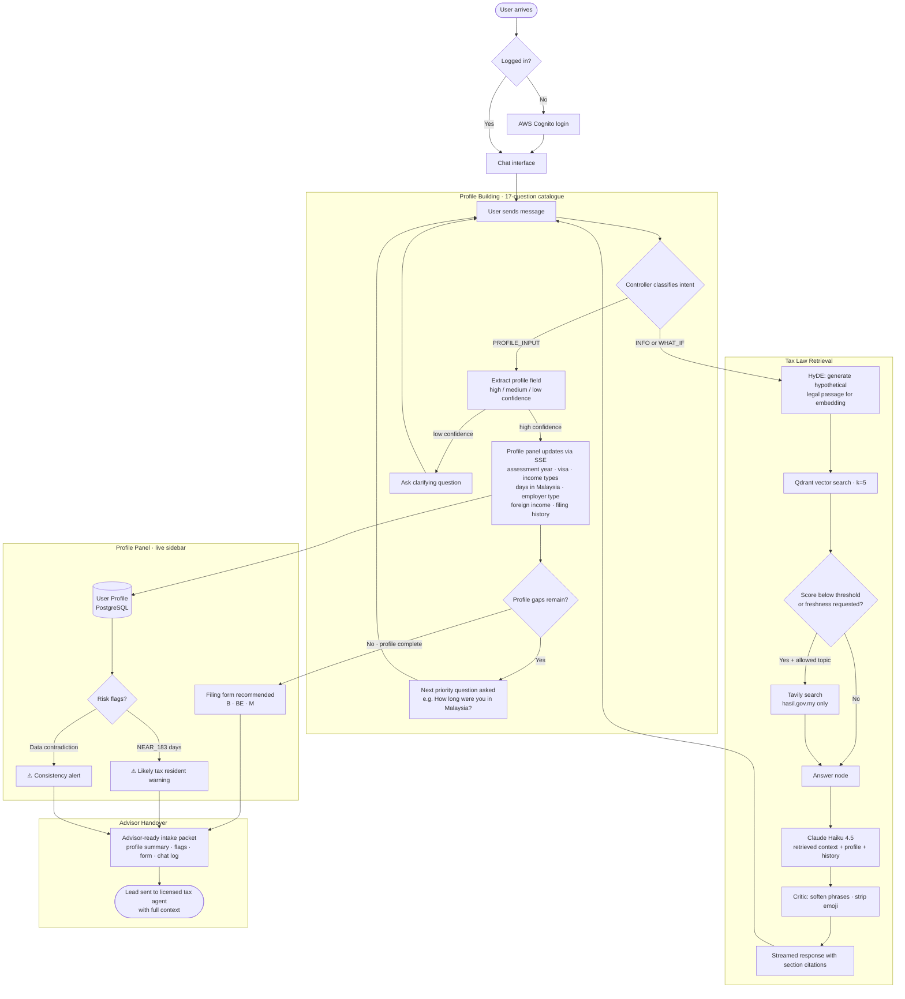

# Malaysia Tax Guide for Digital Nomads

https://www.loom.com/share/5842dc907ca74454b54d0e93410d56a3

Digital nomads living and working in Malaysia struggle to determine their tax residency and filing obligations because the rules are technical, fragmented across legal documents, and easy to misinterpret without professional guidance.

## The Problem

Digital nomads often move between jurisdictions, work remotely for foreign employers, invoice offshore clients, and receive income in multiple forms. Malaysian tax rules determine liability based on physical presence, income sourcing, and treaty conditions — not simply where a bank account is located or where a company is registered. Misunderstanding these rules can result in unexpected tax exposure, penalties, or double taxation.

Most individuals either rely on informal online advice, which is frequently inaccurate or oversimplified, or must immediately hire an international tax advisor, which is costly and time-consuming. There is a clear gap between "guessing" and "engaging a licensed tax agent."

## Proposed Solution

A logic-driven Malaysia Tax Guide using RAG over official legislation, public rulings, and guidance curated by a licensed accountant. The system analyses a user's travel patterns and income structure, explains how Malaysian tax rules apply, cites authoritative sources, and identifies filing obligations and potential risk areas.

The application does not provide tax advice or final tax computations. Instead, it produces a structured assessment and an advisor-ready intake packet, with referral to the same licensed accountant network that provided the underlying legal framework.

## Target Audience

Digital nomads and remote professionals spending time in Malaysia while working for foreign employers or clients. Common questions:

- "If I work remotely from Malaysia for 4 months, do I owe tax?"
- "Does being paid into a foreign bank account make my income exempt?"
- "If I stay under 183 days, am I automatically safe?"
- "Are foreign dividends taxable if I bring them into Malaysia?"
- "Do I need to file a Malaysian tax return?"

## User Flow



## Evaluation Inputs

Sample prompts and expected retrieval targets:

| Prompt | Expected retrieval |
|---|---|
| "I spent 190 days in Malaysia in 2025 while working remotely for a UK employer." | Section 7 ITA — residency status |
| "I was in Malaysia for 150 days employed by a Singapore company with no Malaysian office." | DTA Article 15 — salary borne by Malaysian entity |
| "I freelanced for US clients while staying 3 months in Malaysia." | Section 4(a) and Section 12 — sourcing rules |
| "I receive UK dividends while resident in Malaysia. Are they taxable?" | Schedule 6 and June 2024 FSI guideline |
| "I was in Malaysia 45 days only." | PR 8/2011 — 60-day exemption, employment vs contractor |

## Architecture

```
┌──────────────────────────────────────────────────────────────────────────────────────────┐
│ BROWSER  Next.js 15 · Tailwind CSS 4 · Vercel AI SDK                                    │
└────────────────────────────────────────────────────────────────────────────┬─────────────┘
          │  profile REST (CRUD)                                              │  login/token
          │                                                          ┌────────▼──────────┐
          │                                                          │   AWS Cognito     │
          │                                                          └───────────────────┘
          ▼  SSE stream
┌─────────────────────────────────────┐
│ VERCEL  Next.js API Routes          │
│  /api/chat  ·  /api/mock            ├──── profile CRUD ────────► PostgreSQL
└──────────────────┬──────────────────┘                            (user profiles)
                   │  POST /app/chat
                   ▼
┌──────────────────────────────────────────────────────────────────────────────────────────┐
│ FastAPI + Uvicorn                                                                        │
│                                                                                          │
│  ┌────────────────────────────────────────────────────────────────────────────────────┐  │
│  │ LangGraph StateGraph                                                               │  │
│  │                                                                                    │  │
│  │  ┌─────────────────────────────────┐                                               │  │
│  │  │ 1. CONTROLLER  (no LLM)         ├── load thread ──────────────────► Redis       │  │
│  │  │    intent_classifier            │   (AsyncRedisSaver)                           │  │
│  │  │    topic_classifier             │                                               │  │
│  │  │    freshness_requested          │                                               │  │
│  │  │    next_question                │                                               │  │
│  │  │    parse_answer_for_field       │                                               │  │
│  │  │    presence_calculator          │                                               │  │
│  │  │    filing_form_selector         │                                               │  │
│  │  │    consistency_checker          │                                               │  │
│  │  └──────────────┬──────────────────┘                                               │  │
│  │                 │◄── emits profile_patch SSE event                                 │  │
│  │                 │                                                                  │  │
│  │         retrievalQuery?                                                            │  │
│  │    yes ─────────┘──────── no ──────────────────────────────-────────────┐          │  │
│  │    ▼                                                                    │          │  │
│  │  ┌─────────────────────────────────┐                                    │          │  │
│  │  │ 2. RETRIEVE                     ├── embed query ────────────-─────► OpenAI API  │  │
│  │  │    similarity_search_with_score ├── k=5 vector search ──────-─────► Qdrant Cloud│  │
│  │  │    collection: malaysia-tax-laws│   (scored chunks + section refs)              │  │
│  │  └──────────────┬──────────────────┘                                    │          │  │
│  │                 │                                                       │          │  │
│  │     max_score < 0.25 OR freshness_requested?                            │          │  │
│  │    yes ─────────┘────── no ─────────────────────────────────────────────┤          │  │
│  │    ▼  (+ topic in allowed set)                                          │          │  │
│  │  ┌─────────────────────────────────┐                                    │          │  │
│  │  │ 3. TAVILY LOOKUP                ├── search (topic-scoped URLs) ──► Tavily API   │  │
│  │  │    allowlist: hasil.gov.my only │   DTA / Public Rulings /                      │  │
│  │  │    max 5 results                │   Filing Deadlines pages only                 │  │
│  │  └──────────────┬──────────────────┘                                    │          │  │
│  │                 └────────────────────────────────────────────────────-──┘          │  │
│  │                                    ▼                                               │  │
│  │  ┌──────────────────────────────────────────────────────────────────────────────┐  │  │
│  │  │ 4. ANSWER                                                                    │  │  │
│  │  │    compose context:                                         ┌─────────────┐  │  │  │
│  │  │      <profile_context>  ·  <decision_map>  ·  <flags>       │ Anthropic   │  │  │  │
│  │  │      <retrieved_context>  ·  <freshness_addendum>    ──────►│ Claude      │  │  │  │
│  │  │      <suggested_form>  ·  <next_question>                   │ Haiku 4.5   │  │  │  │
│  │  │    stream tokens ──► SSE message events                     └─────────────┘  │  │  │
│  │  └──────────────────────────────────────────────────────────────────────────────┘  │  │
│  │                                    ▼                                               │  │
│  │  ┌─────────────────────────────────┐                                               │  │
│  │  │ 5. CRITIC  (no LLM)             ├── save thread ────────────────-──► Redis      │  │
│  │  │    regex phrase softening       │   (AsyncRedisSaver)                           │  │
│  │  │    question-count warning       │                                               │  │
│  │  └─────────────────────────────────┘                                               │  │
│  └────────────────────────────────────────────────────────────────────────────────────┘  │
└──────────────────────────────────────────────────────────────────────────────────────────┘

                              ── OFFLINE ──
┌──────────────────────────────────────────────────────────────────────┐
│  Evaluation  (Jupyter notebooks)                                     │
│  golden_dataset.json ──► POST /app/chat/eval ──► RAGAS               │
│  faithfulness · context_precision · context_recall · answer_relevancy│
│  + deterministic: one_question_compliance · citation_coverage ·      │
│                   advice_leakage                                     │
└──────────────────────────────────────────────────────────────────────┘
```

## Tooling Choices

| Layer | Tool | Why |
|---|---|---|
| LLM (chat) | Claude Haiku 4.5 | Best cost-per-token for citation-heavy structured responses on a narrow domain |
| LLM (embeddings) | OpenAI text-embedding-3-small | Cheapest high-quality 1536-dim embedding; LangChain–Qdrant integration works out of the box |
| Agent orchestration | LangGraph StateGraph | Conditional edge routing and typed state match the controller → retrieve → fallback → answer topology exactly |
| Vector database | Qdrant Cloud | Per-chunk similarity score drives the Tavily fallback routing; metadata filtering supports doc-type and jurisdiction queries |
| Web search | Tavily (hasil.gov.my only) | Structured results from official LHDN pages without scraping; allowlist prevents hallucination from unvetted sources |
| Thread memory | Redis (AsyncRedisSaver) | Built-in LangGraph checkpointer; persists full `AgentState` across stateless HTTP requests with no schema changes |
| Evaluation | RAGAS | Covers the four core RAG metrics and accepts the exact `{question, answer, contexts}` shape the eval endpoint emits |
| User interface | Next.js 15 + Vercel AI SDK | AI SDK's `createUIMessageStream` handles SSE token streaming and `profile_patch` events in one pass |
| Deployment | Vercel | Zero-config Next.js deploys; `BACKEND_URL` env var routes to the Python backend |
| Auth | AWS Cognito | Managed JWT issuance for the `Authorization: Bearer` pattern; no login system to build |
| User profile storage | PostgreSQL | Structured relational data with PATCH semantics and audit timestamps |

## RAG Components

### Data Sources

Seven PDFs curated by a licensed accountant, stored in `data/` and ingested into the `malaysia-tax-laws` Qdrant collection:

| Document | Type | Reference | Authority |
|---|---|---|---|
| Income Tax Act 1967 | Primary legislation | Act 53 | 1 (highest) |
| Residence Status of Individuals | Public ruling | PR 11/2017 | 2 |
| Residence Status of Individuals (Updated) | Public ruling | PR 5/2022 | 2 |
| Tax Relief for Resident Individual | Public ruling | PR 2/2012 | 2 |
| Tax Treatment of Employee Benefits | Public ruling | PR 8/2011 | 2 |
| Tax Treatment: Income Received from Abroad | Guidelines | Guidelines June 2024 | 3 |
| Tax Incentives for Organisations | Technical announcement | Technical Announcement Jan 2025 | 3 |

Each chunk carries metadata: `reference`, `authority_level`, `doc_type`, `topics`, `year`, `page`, `source_hash`. The `reference` field (e.g. "PR 11/2017") is what the LLM is instructed to cite; `authority_level` is stored for future re-ranking.

### Retrieval → Augmentation → Generation

- **Retrieval:** `similarity_search_with_score(query, k=5)` against Qdrant using `text-embedding-3-small`. If `max_qdrant_score < 0.25` and the topic is `DTA_COUNTRY_LIST | PUBLIC_RULING_UPDATE | FILING_DEADLINE_CHANGE`, falls through to Tavily (hasil.gov.my only).
- **Augmentation:** Retrieved chunks are injected as `<retrieved_context>` alongside `<profile_context>`, `<decision_map>`, `<flags>`, `<freshness_addendum>`, `<suggested_form>`, and `<next_question>` XML blocks. Last 10 conversation messages are appended as history.
- **Generation:** Single Claude Haiku 4.5 call. Instructed to answer first, cite section numbers, then ask exactly one profiling question verbatim. The deterministic critic node applies regex phrase softening post-generation — no second LLM call.

## Agent Components

**Controller** (deterministic, no LLM) — classifies intent (`INFO | PROFILE_INPUT | WHAT_IF`), topic, and freshness signal; selects the next unanswered field from a priority-ordered 17-question catalogue; parses free-text answers into typed profile patches with high/medium/low confidence tiers; computes days-in-jurisdiction and rolling 12-month window for the DTA 183-day test; selects the filing form (B/BE/M); flags data contradictions. Emits a `profile_patch` SSE event on high-confidence extractions.

**Retrieve** — Qdrant vector search; writes `retrieved_chunks` and `max_qdrant_score` to graph state.

**Tavily Lookup** — conditional web search triggered only for the three allowed topics when Qdrant score is low or the user requests fresh information.

**Answer** — single LLM call; streams tokens as SSE `message` events.

**Critic** (deterministic, no LLM) — applies 5 phrase-softening regex rewrites; saves thread checkpoint to Redis.

## Chunking Strategy

**Settings:** `chunk_size=1200`, `chunk_overlap=250`, `RecursiveCharacterTextSplitter` with separators `["\n\n\n", "\n\n", "\n", ". ", " ", ""]`

### Why RecursiveCharacterTextSplitter

Legal PDFs have natural structure — paragraphs, numbered sections, sub-clauses. The recursive splitter tries each separator from most structural (`\n\n\n` = section break) to least (`" "` = word boundary), only falling back to finer splits when necessary. Chunks are far more likely to contain a complete clause rather than cutting mid-rule.

### Why chunk_size=1200 (~250–300 tokens)

Malaysian tax legislation is dense and cross-referential. At 1200 characters you can typically fit one full numbered section with its sub-clauses. Smaller chunks (e.g. 500 chars) routinely split a rule from the exception that qualifies it. Larger chunks (2000+) introduce unrelated adjacent sections that dilute retrieval signal.

### Why chunk_overlap=250 (~21%)

Ensures a rule straddling a chunk boundary appears in full in at least one chunk. Without overlap, a sentence like "A person is resident if in Malaysia for 182 days... [boundary] ...or linked to an adjacent year under PR 11/2017" would never be retrieved as a unit. 250 characters (~1–2 sentences) is enough to preserve continuity without doubling storage.

### Why PyPDFLoader

Source documents are government-issued PDFs with clean, digital text — no OCR needed. `PyPDFLoader` preserves the page number in chunk metadata, enabling the LLM to cite the exact page of the source document.


## Evals

### Evaluation Results v1

```
One Question Compliance:  90.0%
Citation Coverage:        66.7%
Advice Leakage (pass%):   90.0%
Avg chunks per question:  2.00
Avg max similarity score: 0.3213

Total cases evaluated:        30
Cases with RAGAS scores:      15
Avg retrieved chunks/Q:       2.00
Avg max similarity score:     0.3213

Total cases evaluated:    30
Cases with RAGAS scores:  15
```

**Diagnostic notes**

- OQC failures (3): `res_02`, `res_06`, `fil_04`
- Citation coverage failures (10): `res_01`, `res_02`, `res_03`, `res_04`, `res_05`, `res_07`, `res_08`, `inc_03`, `inc_04`, `dta_01`
- Advice leakage detected (3): `res_01`, `res_02`, `fsi_03`
- Low faithfulness (<0.5): "Can I be a tax resident in Malaysia if I was only...", "If I earn both employment and business income...", "Does Malaysia have a double tax agreement with the...", "What is a permanent establishment in Malaysian tax...", "I have a foreign rental property. If I bring rent..."

### Conclusions v1

**Intent misclassification — root cause**

13 INFO → PROFILE_INPUT: Every question starting with "I spent...", "I work...", "I visited..." was classified as profile input, meaning the controller set no `retrievalQuery`, retrieval was skipped, and answers were generated with zero context. 1 WHAT_IF → PROFILE_INPUT had the same problem. 5 INFO → WHAT_IF was less harmful — WHAT_IF still triggers retrieval, but the profiling branch runs unnecessarily.

The classifier is matching first-person phrasing ("I spent 190 days") as profile data, when the user is actually asking a factual/legal question using their situation as context. This is the single cascading failure that causes everything else.

Effect: 15/30 (50%) cases have zero retrieved contexts. Citation coverage is 33% almost entirely because you cannot cite what you never retrieved.

**Advice leakage — regex bug in the critic**

3 failures (`res_01`, `res_02`, `fsi_03`). The LLM output contained "you must" and the critic’s phrase softening replaced it with "it’s typically the case that you must" — which still contains the banned phrase "you must". The replacement pattern doesn’t actually remove the trigger; it wraps it. The advice_leak regex then correctly detects it.

**Faithfulness — LLM adds ungrounded claims**

Mean faithfulness 0.574 (below the 0.7 production threshold). Notable failures:

- `res_02` (0.44): Answer claims "90 days or more in each of the preceding 2 years" — this is not in PR 11/2017; the LLM conflated ITA s7(1)(c) with s7(1)(b).
- `res_06` (0.29): Answer states the prior-year period "must be consecutive" — the retrieved text says 182+ consecutive days in the following year, not the prior year; the answer inverted the direction.

The pattern: the LLM is filling gaps in the retrieved context with general knowledge that either contradicts or goes beyond the retrieved chunks.

**Context Recall — wrong chunks retrieved**

Recall of 0.489 means roughly half the information needed to answer is not in the 5 retrieved chunks. Cases `res_06` and `res_08` have context_recall = 0.0 despite having 4 chunks each — the retrieval returned related-but-wrong chunks that don’t contain the specific rule the question is about.

### Potential Improvements v1

**HyDE (Hypothetical Document Embeddings)**

User queries are conversational ("I spent 190 days in Malaysia — am I resident?") while the source chunks are dense formal legal text ("An individual is resident if present for 182 or more days in the basis year pursuant to ITA s7(1)(a)...") — these two registers embed into very different vector spaces, which is why similarity scores were low and wrong chunks were returned. HyDE bridges this gap by first prompting the LLM to generate a short hypothetical passage written in the language of a Malaysian tax statute, then embedding that passage rather than the original message, so the vector query lands in the same embedding neighbourhood as the actual legal chunks.

### Evaluation Results v2

```
One Question Compliance:  96.7%
Citation Coverage:        86.7%
Advice Leakage (pass%):   100.0%
Avg chunks per question:  3.60
Avg max similarity score: 0.6627

Total cases evaluated:        30
Cases with RAGAS scores:      27
Avg retrieved chunks/Q:       3.60
Avg max similarity score:     0.6627

Total cases evaluated:    30
Cases with RAGAS scores:  27
```

**Diagnostic notes**

- OQC failures (1): `fil_04`
- Citation coverage failures (4): `res_05`, `inc_07`, `dta_01`, `dta_04`
- Advice leakage: none detected
- Low faithfulness (<0.5): "I was in Malaysia for exactly 182 days in 2025...", "I was in Malaysia Oct 2025 to March 2026...", "I left Malaysia on 1 December 2025 and returned on...", "If I earn both employment and business income...", "What is a permanent establishment in Malaysian tax..."

### Before / After

| Metric | Before | After | Change |
|---|---|---|---|
| No contexts retrieved | 15/30 (50%) | 3/30 (10%) | −40pp |
| Intent accuracy | 11/30 (37%) | 22/30 (73%) | +36pp |
| Citation coverage | 10/30 (33%) | 17/30 (57%) | +24pp |
| Advice leakage | 3 failures | 0 failures | 100% |
| OQC (≤1 question) | 27/30 (90%) | 26/30 (87%) | ≈ same |
| RAGAS coverage | 5/30 scored | 27/30 scored | much more complete |
| Faithfulness | 0.574 | 0.699 | +0.125 |
| Context Precision | 0.767 | 0.883 | +0.116 |
| Context Recall | 0.489 | 0.549 | +0.060 |
| Answer Relevancy | 0.410 | 0.449 | +0.039 |

### Conclusions v2

The intent classifier fix was the structural unlock — retrieval failures dropped from 50% to 10%, which cascaded into better citations (+24pp) and gave RAGAS enough data to score 27 cases instead of 5. The faithfulness and context precision jumps (both ~0.12) are a combined effect of HyDE retrieving more relevant chunks and the system prompt telling the LLM to stay within retrieved context. Advice leakage reaching 100% confirms the critic replacement fix worked cleanly.

### Potential Improvements v2

Context Recall at 0.549 and Answer Relevancy at 0.449 have a ceiling: recall is limited by what the 7-PDF corpus covers, and relevancy is structurally penalised by the mandatory follow-up question that RAGAS interprets as deflection.

Overall the changes had the intended effect — the most actionable improvements landed exactly where the root causes were.

## Next Steps

HyDE improved retrieval significantly — precision is at 0.883, meaning Qdrant returns relevant chunks when it retrieves. Context Recall (0.549) and Answer Relevancy (0.449) have room to improve. The likely fix is hybrid search (dense + BM25): Malaysian tax law relies on exact terms like `s7(1)(a)`, `PR 11/2017`, and `Schedule 6` that keyword matching handles better than semantic similarity alone, especially when HyDE’s hypothetical passage uses different wording than the source.

- Move embeddings to Postgres (pgvector) or unify storage strategy
- Add audit log (profile changes + reasoning trace)
- Build accountant referral packet (editable summary export)
- Add advisor dashboard / intake endpoint
- Implement risk-trigger → advisor suggestion logic
- Add versioned corpus snapshots + update monitoring
- Load test + latency optimisation
- Multi-jurisdiction abstraction (remove MY assumptions)

## P.S.

I didn’t want to build another free-form chatbot. I wanted something you could actually trust in a regulatory context. So all the critical logic: intent detection, profile updates, day calculations, filing form selection, consistency checks — runs in deterministic Python, keeping real decisions out of the LLM’s hands and reducing hallucination risk where it actually matters. That’s my favourite part.

example of behind the scenes:
```
-[CONTROLLER] intent=INFO topic=DTA_COUNTRY_LIST freshnessRequested=True retrievalQuery=yes
-[HYDE] generated passage (1008 chars) for query: Has Malaysia's list of DTA countries recently changed? Is th
-[RETRIEVE] maxQdrantScore=0.7152 chunkCount=5 topic=DTA_COUNTRY_LIST freshnessRequested=True
-[TAVILY] tavily_triggered=True tavily_reason=freshnessRequested topic=DTA_COUNTRY_LIST maxQdrantScore=0.7152 tavilyResultCount=5
-[CRITIC] Stripped 52 emoji
-[CRITIC] Flattened 74 ALL CAPS word(s)
-[CRITIC] Warning: 23 question marks in response
```